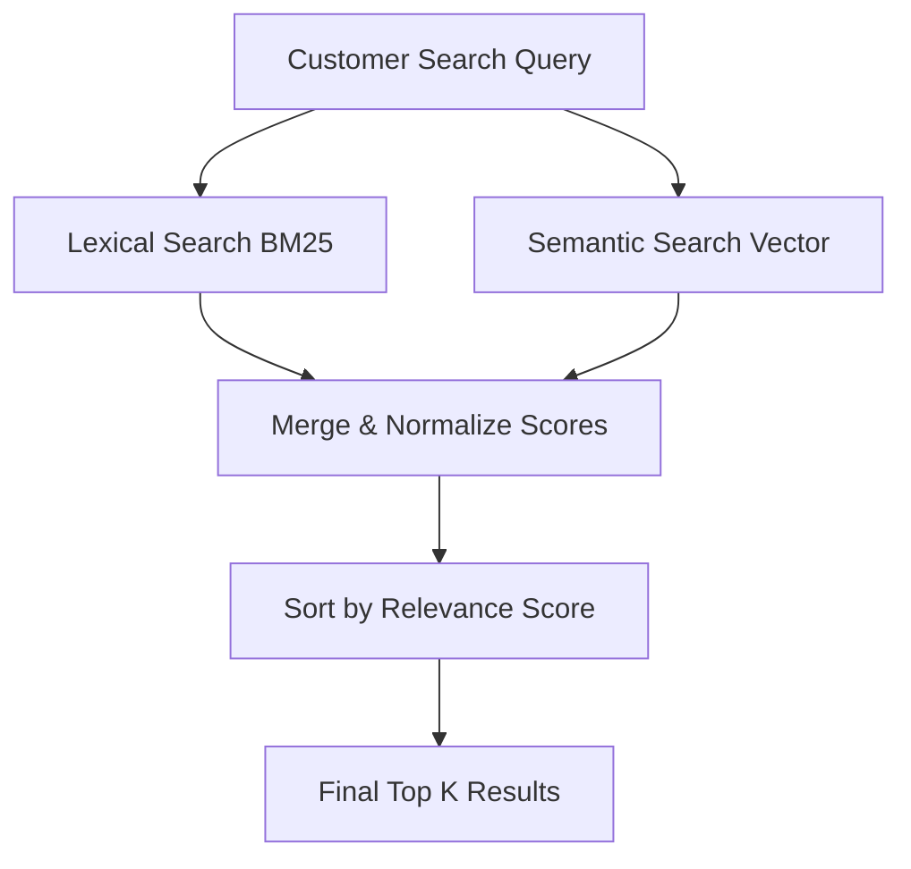

# IMPROVING ORDER HISTORY SEARCH USING SEMANTIC SEARCH WITH AMAZON OPENSEARCH SERVICE

If you have ever shopped on Amazon, you have likely used the **Your Orders** page. This feature keeps track of your complete order history dating back to 1995, allowing you to search, track, and manage every past purchase. The order history search feature makes it easy to find previous orders using keywords. More than just finding items, it helps you quickly repurchase products, saving time and effort.

Various applications across Amazon (such as the AI shopping assistant Rufus and the voice assistant Alexa) rely on order history search to locate past purchases. Therefore, it is critical that this search is accurate, intuitive, and fast.

This blog post explains how Amazon's **Your Orders** team improved the search experience by introducing semantic search capabilities on top of their existing lexical search system, utilizing **Amazon OpenSearch Service** and **Amazon SageMaker**.

---

## Limitations of Lexical Search

Traditionally, order history search has relied on **lexical matching** (keyword matching). This retrieves items matching one or more search terms. For example, if a customer searches for *"orange juice"*, the system retrieves orange juice, fresh oranges, and other fruit juices ordered in the past.

While lexical search is highly effective for exact keyword matches, it has significant limitations:

- **Synonym & Semantic Mismatch:** It cannot handle generic or conceptual keywords. A search for *"healthy drinks"* would fail to return *"kombucha"*, *"green tea"*, or *"protein shakes"* if those exact words are not in the product title or description.
- **Conversational Queries:** Since the launch of Rufus, customers increasingly search using conversational, intent-based queries like *"Show me the healthy drinks I bought last year"*. To support this, the underlying data store must understand the semantic meaning of search queries beyond conventional word matching.

---

## Technical Challenges of Implementing Semantic Search at Scale

Integrating semantic search into a system of Amazon's scale presented several major technical challenges:

1. **Massive Scale:** The system must support semantic search across billions of global customer order records.
2. **Zero Downtime:** The system must remain 100% available and maintain strict Service Level Agreements (SLAs) during the migration.
3. **Preventing Search Quality Degradation:** While semantic search helps with conceptual queries, it can degrade the experience for exact queries. For example:
   - If a customer searches for a specific product name, returning similar/semantically related products alongside the exact match can crowd the results and frustrate the user.
   - Semantic search is ineffective for searches using strict identifiers (e.g., searching for a specific *Order ID*), which have no semantic meaning. In these cases, lexical search must be preserved.

---

## Solution Architecture Overview

Semantic search is powered by **Large Language Models (LLMs)**. These models take a text input (customer search terms or product descriptions) and generate a fixed-length numerical vector representation called an **embedding**. Embedding vectors capture the semantic meaning of the text: semantically similar texts will have a high **cosine similarity** score between their respective embedding vectors.

Amazon's solution is divided into two major architectural parts:

1. **System Resiliency:** Transitioning to a cell-based architecture to handle the resource-intensive vector workloads.
2. **Semantic Pipeline:** Building the vector generation, storage, and retrieval flows.

*Figure 1. Cell-based architecture diagram showing how customer requests are routed to Amazon OpenSearch Service domains via hash-based partitioning*

---

## Scalability and Resiliency: Cell-Based Architecture

To handle the additional computational load of vector searching, the team adopted a **cell-based architecture**. This pattern partitions the entire system into smaller, self-contained, and identical chunks called **cells**.

- **Customer Partitioning:** Each cell serves a defined subset of customers. Cells operate independently and do not need to communicate with each other.
- **Routing Logic:** Customer requests are routed to their assigned cells at runtime. Assignment details can be calculated dynamically or fetched from a cache/persistent store like **Amazon DynamoDB**. This makes it easy to rebalance cells if some become "heavier" than others.
- **Resiliency:** If a cell fails, only a fraction ($1/N$) of the customer base is affected, rather than a total system outage. Partitioning keys can also be assigned to multiple cells to write data redundantly and avoid data loss.

---

## Implementing Semantic Search

Implementing the core semantic search features involved several key decisions and infrastructure steps:

*Figure 2. Read-flow and write-flow for semantic search using Amazon OpenSearch Service and Amazon SageMaker embedding vectors*

### 1. Model Evaluation & Selection

The team used an embedding model trained on Amazon-specific e-commerce data. Domain-specific training is critical so the model understands business context and product terms.

To select the best model, they used an **LLM-as-a-Judge** methodology using Anthropic's Claude on **Amazon Bedrock**. Claude graded and ranked anonymized items against search phrases, creating a ground truth. Models were evaluated using ranking metrics:

- **Normalized Discounted Cumulative Gain (NDCG):** Measures ranking quality.
- **Mean Reciprocal Rank (MRR):** Considers the position of the first relevant item.
- **Precision & Recall:** Rates accuracy and completeness.

### 2. Infrastructure Deployment

The chosen embedding model was containerized, registered in **Amazon Elastic Container Registry (Amazon ECR)**, and deployed using **Amazon SageMaker Inference Endpoints** to compute vectors at scale.

### 3. Vector Storage & Search with OpenSearch Service

The team leveraged two key features of **Amazon OpenSearch Service**:

- **`knn_vector` datatype:** Built-in support for storing embedding vectors. Since the number of records per customer is relatively small, they used **exact k-NN search** rather than approximate k-NN, allowing the system to scale without sacrificing accuracy.
- **Scripted Scoring:** Painless scripts compute vector similarity server-side, reducing client complexity and maintaining low latency.

---

## Hybrid Search: Combining Lexical & Semantic Power

To get the best of both worlds, the team implemented **Hybrid Search**. OpenSearch Service's hybrid query capabilities run both lexical (BM25) and semantic queries in parallel.

- **Parallel Execution:** Both queries run concurrently.
- **Score Normalization:** OpenSearch normalizes and merges relevance scores.
- **Fallback for Identifiers:** In cases where semantic search is not suitable (e.g., searching by `orderId`), the system relies solely on keyword matching.
- **Resiliency:** If a transient failure occurs in the semantic path, the query automatically falls back to lexical-only search to ensure the customer always receives results.

---

## Backfilling: Processing Historical Data

For semantic search to be useful, historical order data needed to be updated with embedding vectors.

The team built a data processing pipeline using:

- **AWS Step Functions** to orchestrate the backfill workflow.
- **AWS Lambda** to process legacy records and call SageMaker endpoints to generate embedding vectors.
- Billions of documents were successfully processed at ingestion rates multiple times higher than normal, showing the durability and scaling capacity of OpenSearch Service under heavy load.

---

## Business & Customer Experience Impact

The deployment of semantic search yielded significant improvements in search quality and business metrics:

- **Improved Customer Experience:** Customers can now search for things like *"sustainable utensils"* and find wooden spoons, or search *"chargers"* and retrieve wall connectors, even if the keyword *"charger"* is missing from the title.
- **10% Improvement in Query Recall:** Increasing the relevance and percentage of searches that return correct results.
- **20% Improvement in Query Success Rate:** More searches now return at least one relevant item.
- **48% Enhanced Result Coverage:** Semantic search surfaces extra relevant matches that lexical search would have completely missed.
- **Integration with Rufus and Alexa:** Empowered downstream assistants to answer complex historical queries easily.

---

## Conclusion

By evolving Amazon's order history search to support semantic capabilities, the team successfully bridged cutting-edge AI technologies with robust, high-scale legacy infrastructure. Utilizing Amazon OpenSearch Service and Amazon SageMaker, the solution maintains strict SLAs and zero downtime while processing billions of customer records.

To get started with building your own semantic search applications, you can explore:

- [Exact k-NN search in OpenSearch](https://docs.opensearch.org/latest/vector-search/vector-search-techniques/knn-score-script/)
- [Amazon OpenSearch Service Developer Guide](https://docs.aws.amazon.com/opensearch-service/latest/developerguide/gsg.html)

**Link dịch bài viết:** [https://www.facebook.com/share/p/191tDRSXB7/](https://www.facebook.com/share/p/191tDRSXB7/)
