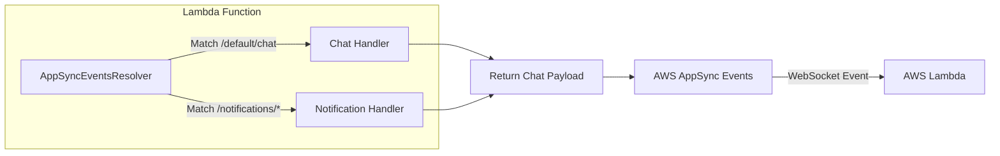

# SIMPLIFY AWS APPSYNC EVENTS INTEGRATION WITH POWERTOOLS FOR AWS LAMBDA

Real-time capabilities have become essential in modern applications, where users expect immediate updates and interactive experiences. Whether you're building chat applications, live dashboards, gaming leaderboards, or IoT systems, AWS AppSync Events enables these real-time features through WebSocket APIs, allowing you to build scalable and performant real-time applications without worrying about connection management or scaling infrastructure.

However, integrating AWS AppSync Events into serverless architectures, specifically handling events in AWS Lambda, often introduces challenges regarding payload serialization, event routing, and batch error handling. To streamline this process, the **Powertools for AWS Lambda** toolkit introduced the `AppSyncEventsResolver` utility, removing the need for boilerplate code and simplifying the development workflow.

---

## The Role of Powertools for AWS Lambda

**Powertools for AWS Lambda** is a developer toolkit designed to optimize serverless development. It provides essential utilities for **Logging**, **Tracing**, **Metrics**, and **Event Handling**.

With the addition of `AppSyncEventsResolver`, Powertools now offers a clean, consistent interface for processing AppSync Events in Lambda functions. It handles the undifferentiated heavy lifting—parsing events, routing them to the correct handler based on patterns, and formatting the response to conform to AppSync expectations—enabling developers to focus entirely on core business logic.

---

## Core Features of AppSyncEventsResolver

`AppSyncEventsResolver` is built to resolve common event processing patterns in real-time applications. The diagram below illustrates how WebSocket events from AWS AppSync are routed to different handlers inside the Lambda function:



### 1. Pattern-based Routing

Instead of writing complex conditional blocks (such as `if-else` or `switch-case`) to manually route events depending on their destination channel, the resolver routes events automatically based on the namespace and channel path pattern.

### 2. Wildcard Support

You can register catch-all handlers using wildcards (e.g., `/default/*`). The resolver automatically matches child channels and forwards incoming events to the registered handler.

### 3. Automatic Response Formatting

AWS AppSync Events expects responses from Lambda functions to adhere to specific structures for connection authorization and event acknowledgement. `AppSyncEventsResolver` automatically generates this response envelope behind the scenes, allowing you to simply return your payload.

### 4. Batch Processing & Error Handling

When processing multiple messages in a single batch request, the resolver supports sequential or parallel execution. It also provides granular, built-in error handling at the individual message level, ensuring successful messages are acknowledged even if one message in the batch fails.

---

## Installation & Setup

`AppSyncEventsResolver` is supported across the major Powertools for AWS Lambda languages: **Python**, **TypeScript**, and **.NET**.

### Package Installation:

- **TypeScript / Node.js:**

```bash
npm install @aws-lambda-powertools/event-handler
```

- **Python:**

```bash
pip install aws-lambda-powertools
```

---

## Implementation Code Examples

### 1. TypeScript Implementation

Here is how to set up publish event handlers in TypeScript using the resolver:

```typescript
import { AppSyncEventsResolver } from '@aws-lambda-powertools/event-handler/appsync-events';

const app = new AppSyncEventsResolver();

app.onPublish('/default/chat', async (payload) => {
    console.log('Received chat payload:', payload);
    return payload;
});

app.onPublish('/notifications/*', async (payload) => {
    console.log('Received system notification:', payload);
    return { status: 'notification_sent' };
});

export const handler = async (event: any, context: any) => {
    return app.resolve(event, context);
};
```

### 2. Python Implementation

In Python, you can utilize decorators to cleanly register handlers for different channels and actions:

```python
from aws_lambda_powertools.event_handler import AppSyncEventsResolver

app = AppSyncEventsResolver()

@app.on_publish(path="/default/chat")
def handle_chat(payload):
    print(f"Received chat payload: {payload}")
    return {"status": "success", "message": payload}

@app.on_subscribe(path="/default/chat")
def handle_subscribe(payload):
    print(f"User subscribed to chat channel: {payload}")
    return {"authorized": True}

def lambda_handler(event, context):
    return app.resolve(event, context)
```

---

## Conclusion

Building large-scale, real-time serverless systems has never been easier. By combining the high scalability of **AWS AppSync Events** with the routing and standardizing capabilities of **Powertools for AWS Lambda**, developers can deploy clean, secure, and highly maintainable WebSocket APIs with minimal effort.

**Link dịch bài viết:** [https://www.facebook.com/share/p/1BS1nG91UA/](https://www.facebook.com/share/p/1BS1nG91UA/)
