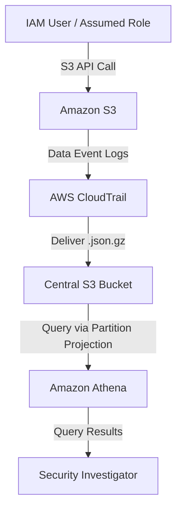

# CENTRALIZED LOGGING AND ANALYSIS OF S3 DATA EVENTS IN AWS CLOUDTRAIL

When a security incident occurs—such as unauthorized access or a bulk deletion in an S3 bucket—the first question is always: **"Who did this?"** Traditional S3 server access logs show *what* request happened, but lack the full IAM identity context to identify the specific user or assumed role.

This post (Part 2 of our S3 audit series) explores how to implement an identity-driven audit system using **AWS CloudTrail data events** and **Amazon Athena**.



---

## S3 Data Events vs. Server Access Logs

CloudTrail data events capture granular API-level tracking for S3 object operations with identity information, complementing HTTP-level access logs.

- **What is Captured:** Detailed IAM user/role identities, API operations (`GetObject`, `PutObject`, `DeleteObject`), authentication context (MFA, role assumption chains), and cross-account access details.
- **What is Not Captured:** HTTP-level performance metrics, status codes, or precise response times (these require S3 server access logs as discussed in Part 1).
- **Delivery & Cost:** Logs are delivered as compressed JSON within ~5 minutes. Cost is $0.10 per 100,000 recorded data events. (Note: Data events do not have a free tier).

---

## Step-by-Step Configuration

To set up centralized, organization-wide S3 audit logging:

1. **Create a CloudTrail Trail:** Under the CloudTrail console, create a new trail (e.g., `s3-data-events-trail`) and target a centralized S3 bucket.
2. **Enable Organization-Wide Logging:** If using AWS Organizations, check **Enable for all accounts in my organization** in the management account to automatically deploy the trail to all member accounts.
3. **Configure Advanced Event Selectors:** Deselect management events (to avoid duplicate logging charges if another trail exists) and select **Data Events** with **S3** as the resource type. You can filter by bucket or prefix.
4. **Configure S3 Lifecycle Policy:** On the central bucket, set a lifecycle rule to transition logs to **Standard-IA** after 90 days, **Glacier** after 180 days, and expire them after 7 years to minimize storage costs.

---

## Creating the Athena Table with Partition Projection

Partition projection calculates partition values dynamically from the S3 path, speeding up queries and reducing metadata scanning costs. Use the query below to create the table:

```sql
CREATE EXTERNAL TABLE cloudtrail_s3_events (
  eventversion STRING,
  useridentity STRUCT<
    type: STRING, principalid: STRING, arn: STRING, accountid: STRING,
    username: STRING, sessioncontext: STRUCT<
      attributes: STRUCT<mfaauthenticated: STRING, creationdate: STRING>,
      sessionissuer: STRUCT<arn: STRING, accountid: STRING, username: STRING>
    >
  >,
  eventtime STRING, eventsource STRING, eventname STRING, awsregion STRING,
  sourceipaddress STRING, useragent STRING, errorcode STRING, errormessage STRING,
  requestparameters STRING, responseelements STRING, additionaleventdata STRING,
  recipientaccountid STRING, sharedeventId STRING
)
PARTITIONED BY (
  account STRING,
  region STRING,
  timestamp STRING
)
ROW FORMAT SERDE 'org.apache.hive.hcatalog.data.JsonSerDe'
STORED AS INPUTFORMAT 'com.amazon.emr.cloudtrail.CloudTrailInputFormat'
OUTPUTFORMAT 'org.apache.hadoop.hive.ql.io.HiveIgnoreKeyTextOutputFormat'
LOCATION 's3://centralized-s3-cloudtrail-logs/AWSLogs/'
TBLPROPERTIES (
  'projection.enabled' = 'true',
  'projection.account.type' = 'injected',
  'projection.region.type' = 'injected',
  'projection.timestamp.type' = 'date',
  'projection.timestamp.format' = 'yyyy/MM/dd',
  'projection.timestamp.range' = '2024/01/01,NOW',
  'projection.timestamp.interval' = '1',
  'projection.timestamp.interval.unit' = 'DAYS',
  'storage.location.template' = 's3://centralized-s3-cloudtrail-logs/AWSLogs/${account}/CloudTrail/${region}/${timestamp}/'
);
```

*Note: For Organization-wide trails, add `organization_id STRING` as the first partition column and inject it into the `storage.location.template`.*

---

## Key Security Query Patterns

Athena partition projection requires specifying `account`, `region`, and `timestamp` in the `WHERE` clause of every query to prune partitions and avoid expensive full-table scans.

### 1. Trace Specific User Activity

Identifies S3 data-plane actions performed by an IAM user or role on a given day:

```sql
SELECT eventtime, useridentity.arn as user_arn, eventname, sourceipaddress,
       JSON_EXTRACT_SCALAR(requestparameters, '$.bucketName') as bucket,
       JSON_EXTRACT_SCALAR(requestparameters, '$.key') as object_key
FROM cloudtrail_s3_events
WHERE account = '123456789012' AND region = 'us-east-1' AND timestamp = '2026/05/15'
  AND (useridentity.username = 'specific-user' OR useridentity.arn LIKE '%specific-user%')
  AND eventname IN ('GetObject', 'PutObject', 'DeleteObject')
ORDER BY eventtime DESC;
```

### 2. Cross-Account Access Monitoring

Flags S3 operations originating from external AWS accounts:

```sql
SELECT eventtime, useridentity.accountid as source_account, recipientaccountid as target_account,
       useridentity.arn as user_arn, eventname, sourceipaddress
FROM cloudtrail_s3_events
WHERE account = '123456789012' AND region = 'us-east-1' AND timestamp = '2026/05/15'
  AND useridentity.accountid != recipientaccountid
ORDER BY eventtime DESC;
```

### 3. Surface Failed Access Attempts

Detects permission errors (`AccessDenied`, `NoSuchKey`), highlighting potential scanning or brute-force attempts:

```sql
SELECT eventtime, useridentity.arn as user_arn, eventname, sourceipaddress, errorcode, errormessage
FROM cloudtrail_s3_events
WHERE account = '123456789012' AND region = 'us-east-1' AND timestamp = '2026/05/15'
  AND errorcode IS NOT NULL
ORDER BY eventtime DESC LIMIT 100;
```

### 4. Delete Operations Audit

Audits object deletions over a date range, tracking assumed roles and MFA status:

```sql
SELECT eventtime, useridentity.arn as user_arn, sourceipaddress,
       JSON_EXTRACT_SCALAR(requestparameters, '$.bucketName') as bucket,
       JSON_EXTRACT_SCALAR(requestparameters, '$.key') as deleted_object,
       useridentity.sessioncontext.attributes.mfaauthenticated as mfa_used
FROM cloudtrail_s3_events
WHERE account = '123456789012' AND region = 'us-east-1'
  AND timestamp BETWEEN '2026/05/15' AND '2026/05/17'
  AND eventname IN ('DeleteObject', 'DeleteObjects')
ORDER BY eventtime DESC;
```

---

## Best Practices & Troubleshooting

- **Partition Pruning is Crucial:** Always filter on partition columns (`account`, `region`, `timestamp`) first. Using `eventtime` alone leads to scanning the entire table, increasing cost.
- **Exclude HeadObject:** If you experience high costs from metadata operations, configure CloudTrail event selectors to exclude `HeadObject` API calls.
- **Integrity and Security:** Enable log file validation to ensure logs are tamper-proof. For maximum security, isolate logs in a dedicated AWS log-archive account.
- **HIVE_PARTITION_SCHEMA_MISMATCH:** If this error occurs, verify that the `storage.location.template` matches your actual S3 path structure.

---

## Conclusion

Centralizing S3 data events via CloudTrail provides the vital identity context needed for security compliance. When combined with Athena partition projection, you can cost-effectively run security investigations across millions of actions.

**Link dịch bài viết:** [https://www.facebook.com/share/p/1UDZGdgAx6/?](https://www.facebook.com/share/p/1UDZGdgAx6/?)
